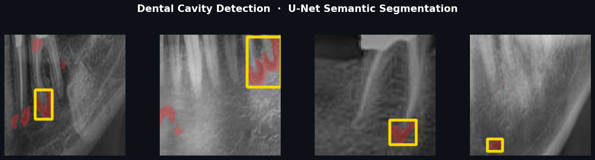
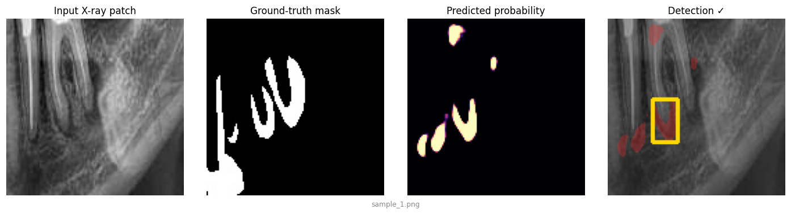
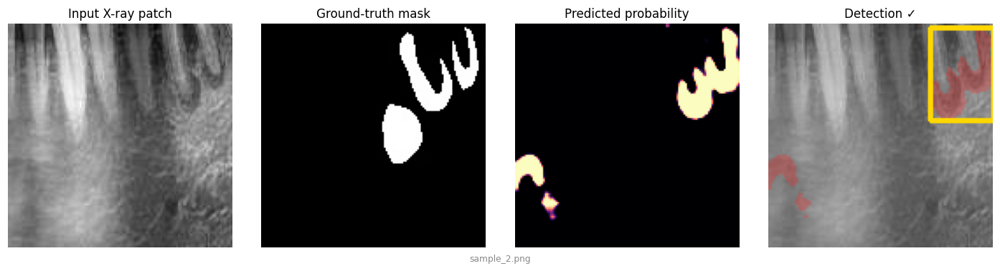
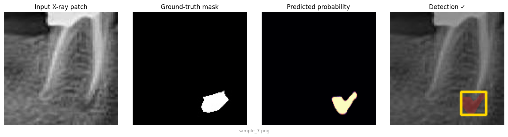
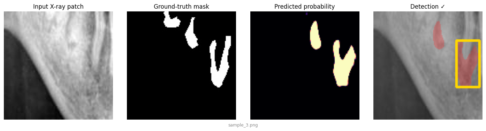

<div align="center">

# 🦷 Dental Cavity Detection with U-Net

**Semantic segmentation of cavities in dental X-ray images — with an interactive Streamlit demo.**



[](https://www.python.org/)
[](https://www.tensorflow.org/)
[](https://streamlit.io/)
[](LICENSE)

</div>

---

## Overview

This project trains a **U-Net** convolutional neural network to find **cavities (caries)** in dental radiographs. Given a grayscale X-ray patch, the model predicts a per-pixel probability map of where a cavity is, which is then thresholded into a mask and drawn back onto the image as a highlighted region with a bounding box.

Cavities are small, faint, and make up only about **3% of the pixels** in a typical patch, so this is a hard, heavily **class-imbalanced** segmentation problem. The model is built and trained with that imbalance in mind (a combined **focal + dice loss**), and is best understood as a **screening / second-opinion aid** that flags suspicious regions for a clinician to review — *not* a diagnostic device.

An interactive **Streamlit** app lets anyone upload an X-ray (or pick a bundled sample) and see the prediction instantly.

---

## Demo

> 🔗 **Live app:** (https://dental-cavity-detection-fhpczkkbuu3jfb5ctmlks8.streamlit.app/)

Run it locally in two commands:

```bash
pip install -r requirements.txt
streamlit run app.py
```

Then open the local URL Streamlit prints (usually `http://localhost:8501`), upload a dental X-ray or choose one of the samples, and adjust the probability threshold in the sidebar.

---

## Results

The four panels below show, for each sample: the **input X-ray patch**, the **ground-truth mask**, the model's **predicted probability map**, and the final **detection overlay** with a bounding box around the largest region.

| | |
|---|---|
|  |  |
|  |  |

### Metrics

Because the data is so imbalanced, plain pixel accuracy is meaningless (a model that predicts "no cavity everywhere" already scores ~98%). The project therefore reports **Dice, IoU, precision and recall**.

| Metric              | Training (final epoch) | Validation |
|---------------------|:----------------------:|:----------:|
| Dice coefficient    | **0.82**               | ~0.21–0.25 |
| Precision           | 0.88                   | 0.51       |
| Recall              | 0.79                   | 0.16       |
| IoU                 | —                      | 0.14       |
| Pixel accuracy      | —                      | 97.9%      |
| Patch-level sensitivity | —                  | 43.7%      |

**Honest read of these numbers:** the large gap between training and validation Dice shows the model **overfits** the training patches — it learns them well but generalises only partially to unseen scans. At the **patch level** it still flags a suspicious region in roughly **44%** of cavity patches, which is why it is framed as a *second-opinion screening aid* rather than a standalone detector. Improving generalisation (more data, stronger augmentation, regularisation) is the natural next step — see [Limitations](#limitations--future-work).

---

## How it works

**Architecture — U-Net.** A symmetric encoder–decoder with skip connections. The encoder downsamples through three blocks (32 → 64 → 128 filters) to a 256-filter bottleneck; the decoder upsamples back, concatenating the matching encoder features at each level so fine spatial detail is preserved. A final `1×1` convolution with a sigmoid produces the per-pixel cavity probability.

**Input.** Grayscale patches resized to **128 × 128**, normalised to `[0, 1]`.

**Loss — focal + dice.** Focal loss down-weights the easy, abundant background pixels so training focuses on the rare cavity pixels; dice loss directly optimises region overlap. Together they handle the ~3% positive-class imbalance far better than plain cross-entropy.

**Training tricks.** Adam (`lr = 1e-4`), batch size 16, on-the-fly horizontal/vertical flip augmentation, plus `ModelCheckpoint`, `EarlyStopping` and `ReduceLROnPlateau` callbacks.

A full, plain-English walkthrough of the EDA and evaluation lives in [`docs/EDA_and_Evaluation_Explained.md`](docs/EDA_and_Evaluation_Explained.md) and [`docs/Project_Deep_Explanation_Study_Guide.md`](docs/Project_Deep_Explanation_Study_Guide.md).

---

## Project structure

```
teeth/
├── app.py                     # Streamlit web app (upload → predict → visualise)
├── unet_cavity_final.onnx     # Serving model (ONNX) — used by the app, light & fast
├── unet_cavity_final.h5       # Trained U-Net weights (Keras, for training/reference)
├── requirements.txt           # Python dependencies
├── packages.txt               # System deps for Streamlit Cloud
├── .streamlit/config.toml     # App theme / config
├── src/
│   ├── training.py            # Model definition + training pipeline (Colab)
│   └── predict_local.py       # Desktop inference with a file-picker (matplotlib)
├── notebooks/
│   ├── google_colab.ipynb     # EDA + training + evaluation notebook
│   └── EDA_cavity_dataset.ipynb
├── docs/                      # Study guide, EDA explainer, slides, training log
├── samples/
│   ├── images/                # Example X-ray patches for the demo
│   └── masks/                 # Their ground-truth masks
└── assets/                    # Preview images used in this README
```

> The full training/validation image set (`patch_dataset/`) and the raw test patches (`testing/`) are **not** committed — they are large and derived from a public dataset. See [Dataset](#dataset) to reproduce them.

---

## Getting started

### 1. Clone and install

```bash
git clone https://github.com/<your-username>/dental-cavity-detection.git
cd dental-cavity-detection
python -m venv venv && source venv/bin/activate      # Windows: venv\Scripts\activate
pip install -r requirements.txt
```

### 2. Run the Streamlit app

```bash
streamlit run app.py
```

### 3. Or run desktop inference

```bash
pip install matplotlib          # only extra dep for the desktop script
python src/predict_local.py     # opens a file dialog, shows a matplotlib figure
```

### 4. (Optional) Retrain

Open `notebooks/google_colab.ipynb` in Google Colab, point the dataset paths at your copy of `patch_dataset/`, and run top to bottom. `src/training.py` is the same pipeline as a plain script.

---

## Dataset

The model was trained on **dental X-ray patches** — small `128 × 128` crops of radiographs, each paired with a binary cavity mask of the same filename. There are **4,426** training and **730** validation pairs. The `.rf.` in the original filenames indicates the patches were exported and augmented with **[Roboflow](https://roboflow.com/)**.

The raw dataset is not redistributed here. To reproduce, place your patches as:

```
patch_dataset/
├── train/{images,masks}/
└── val/{images,masks}/
```

where each mask shares the exact filename of its image.

> _If you know the original public source of these radiographs, add the link and citation here._

---

## Limitations & future work

- **Overfitting.** The train↔validation Dice gap is large; the model memorises training patches more than it generalises. More diverse data, heavier augmentation, dropout/weight-decay and cross-validation are the obvious levers.
- **Patch-level, not full-scan.** The model works on cropped patches, not whole panoramic X-rays. A tiling/stitching step would be needed for full images.
- **Not a medical device.** ⚠️ This is a research and educational project. It is **not** validated for clinical use and must **not** be used to diagnose real patients.

---

## Tech stack

Python · TensorFlow / Keras *(training)* · ONNX Runtime *(serving)* · OpenCV · NumPy · Streamlit

> The model is trained in Keras and exported to **ONNX** for inference, so the hosted app runs without TensorFlow — it installs cleanly on any Python version and stays well within free-tier resource limits.

## License

Released under the [MIT License](LICENSE).

---

<div align="center">
<sub>Built as a deep-learning portfolio project. Contributions and suggestions welcome.</sub>
</div>
